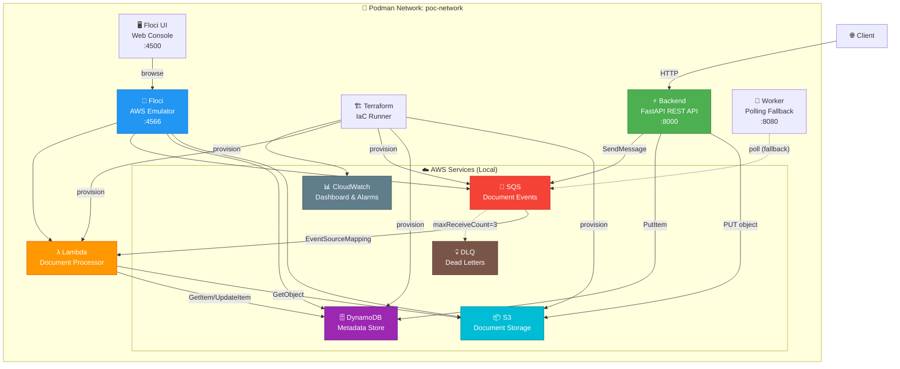
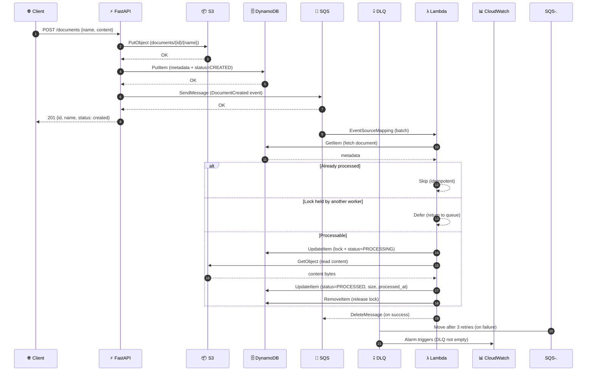
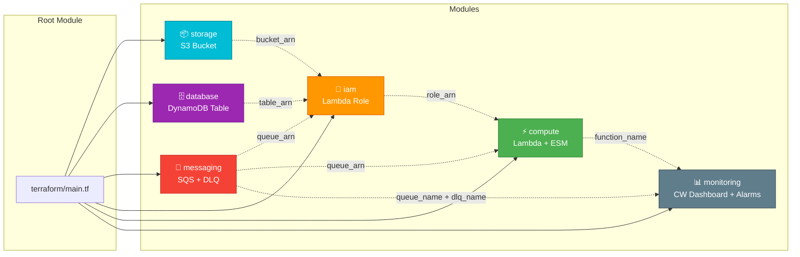
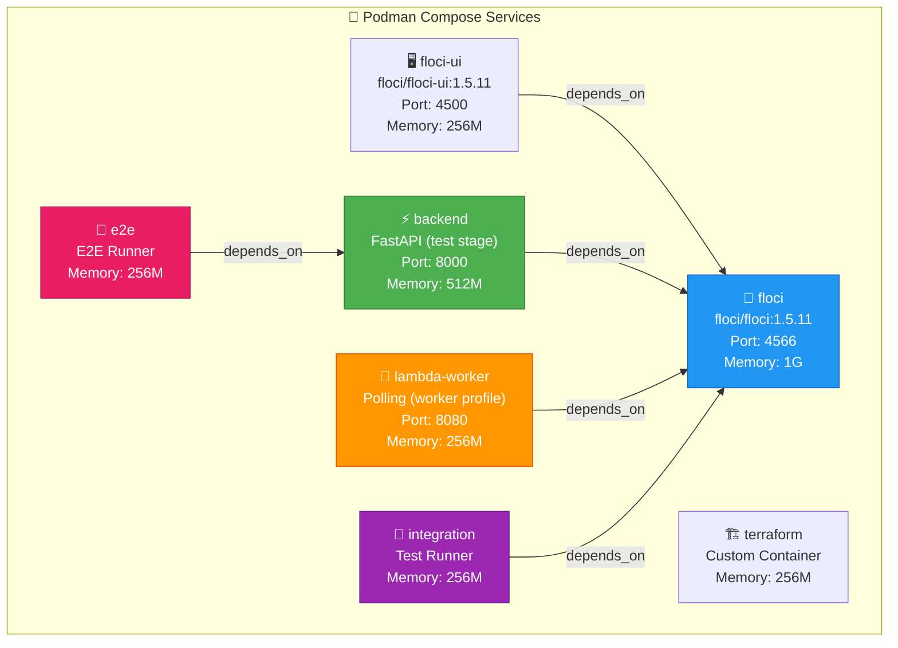
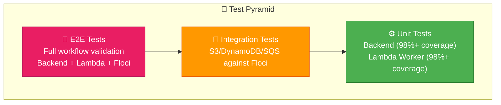

# 🏗️ AWS Local Cloud Lab POC

[](https://www.python.org/)
[](https://fastapi.tiangolo.com/)
[](https://www.terraform.io/)
[](https://podman.io/)
[](LICENSE)

A **local-first AWS learning lab** that replicates the complete AWS development lifecycle — from infrastructure provisioning to asynchronous event-driven processing — without requiring a real AWS account or incurring any cloud costs.

```text
develop → containerize → provision → run → test → observe → destroy → rebuild
```

This POC demonstrates production-grade AWS patterns: **Infrastructure as Code**, **event-driven architecture**, **distributed locking**, **idempotent processing**, and **observability** — all running locally with Floci as the AWS emulator.

---

[📋 Disclaimer](#-disclaimer) · [🚀 Why This Stack?](#-why-this-stack) · [💪 Strengths & Weaknesses](#-strengths--weaknesses) · [🧭 Design Decisions](#-design-decisions) · [🏛️ Architecture](#️-architecture) · [✨ Features](#-features) · [⚙️ Configuration](#️-configuration) · [🧪 Testing](#-testing) · [🎬 Quick Start](#-quick-start) · [📁 Project Structure](#-project-structure) · [🔧 Rake Commands](#-rake-commands)

---

## 📋 Disclaimer

This project is developed for **educational and research purposes** only. It is intended to provide hands-on experience and deepen knowledge in **AWS cloud patterns**, **Infrastructure as Code**, **event-driven architectures**, and **containerized development workflows**.

It is **not designed** for production deployment. The local emulator (Floci) provides an AWS-compatible API surface but does not replicate AWS service limits, networking, security boundaries, or global infrastructure.

The primary focus is to explore **Terraform modularity**, **serverless processing patterns**, **distributed state management**, and **local-first development** — emphasizing developer learning and architectural exploration in a controlled environment.

---

## 🚀 Why This Stack?

### 🐍 Python + FastAPI

Python was chosen for its ubiquity in cloud-native development and FastAPI for its async-first architecture, automatic OpenAPI schema generation, and native Pydantic validation. The backend demonstrates a clean layered architecture:

- **Routes** → HTTP layer (request/response handling)
- **Services** → Business logic (DocumentService with Protocol-based DI)
- **Stores** → Infrastructure adapters (AwsDocumentStore with boto3)

FastAPI's dependency injection system enables testing the full service layer without any AWS connectivity using an `InMemoryDocumentStore`.

### 🏗️ Terraform (Infrastructure as Code)

Terraform provides **idempotent**, **declarative** infrastructure provisioning with full state management. The project uses a **modular architecture** with 6 composable modules:

| Module | Purpose |
|--------|---------|
| `storage` | S3 bucket with versioning, encryption, lifecycle policies |
| `database` | DynamoDB table with PITR and deletion protection |
| `messaging` | SQS queue + DLQ with KMS encryption and redrive policy |
| `compute` | Lambda function + SQS event source mapping |
| `iam` | IAM role with least-privilege policies |
| `monitoring` | CloudWatch dashboard + 4 metric alarms + SNS |

The modular design means each concern is independently testable, versionable, and reusable across projects.

### 🐳 Podman (Rootless Containers)

Podman was chosen over Docker for several deliberate reasons:

- **Rootless by default** — no daemon, no root privileges, significantly reduced attack surface
- **Daemonless architecture** — each container is a direct child of the user process
- **Docker-compatible CLI** — `podman-compose` works as a drop-in replacement
- **Security hardening** — containers run with `no-new-privileges:true` and `tmpfs /tmp`

### ⚡ Floci (Local AWS Emulator)

Floci provides an API-compatible emulation of core AWS services (S3, DynamoDB, SQS, Lambda) on a single port (4566). This enables:

- **Zero-cost development** — no AWS account or billing required
- **Fast iteration cycles** — no network latency for local development
- **CI/CD parity** — the same tests run locally and in production
- **Persistent state** — hybrid storage mode survives container restarts

### 📨 SQS + DLQ (Event-Driven Decoupling)

The architecture uses SQS as the communication backbone between the REST API and the async processor. The Dead Letter Queue (DLQ) pattern ensures:

- **Poison pill isolation** — malformed messages are quarantined after 3 retries
- **Observability** — CloudWatch alarms on DLQ depth provide early warning
- **Retry resilience** — failed messages don't block the main queue

### 🔒 Distributed Locking (DynamoDB Conditional Writes)

The Lambda worker implements a distributed processing lock using DynamoDB conditional writes:

- **Atomic lock acquisition** — `ConditionExpression` prevents race conditions
- **Owner-based release** — only the lock owner can release it
- **Expired lock detection** — locks older than 300 seconds are force-released
- **Idempotent processing** — already-processed documents are skipped

---

## 💪 Strengths & Weaknesses

### ✅ Strengths

| Aspect | Detail |
|--------|--------|
| **Zero cloud cost** | Entire stack runs locally. No AWS account, no billing, no surprise charges. |
| **Production-grade patterns** | IaC, event-driven architecture, DLQ, distributed locking, idempotency — all patterns used in real production systems. |
| **Modular Terraform** | 6 independent modules with clear interfaces. Each module is reusable across projects. |
| **Layered architecture** | Clean separation: Routes → Services → Stores. Protocol-based DI enables testing without AWS. |
| **Comprehensive testing** | Unit tests (98%+ coverage), integration tests against Floci, and end-to-end workflow validation. |
| **Dual-purpose Lambda** | The same `handler.py` works as a Lambda function AND as a polling worker — demonstrating serverless and long-polling patterns. |
| **Observability** | CloudWatch dashboard, 4 metric alarms, SNS notifications, structured JSON logging across all services. |
| **Idempotent processing** | DynamoDB conditional writes prevent double-processing. Already-processed documents are skipped gracefully. |
| **Reproducible automation** | Rake as the single entry point for all development, testing, and deployment workflows. |
| **Security hardening** | Rootless Podman, no-new-privileges, credential isolation, KMS encryption on SQS. |

### ⚠️ Weaknesses / Tradeoffs

| Aspect | Detail |
|--------|--------|
| **Local emulator fidelity** | Floci does not replicate AWS service limits, IAM policies, VPC networking, or eventual consistency behaviors. |
| **No real Lambda cold starts** | Floci Lambda execution via Docker-in-Docker doesn't simulate real Lambda cold start latency or concurrency limits. |
| **Single-region only** | The architecture assumes a single AWS region. Cross-region replication is not addressed. |
| **No TLS termination** | The backend serves plain HTTP. A production deployment would require a reverse proxy or ALB. |
| **Stateful Terraform** | The Terraform state is stored in a Podman volume. A production setup would use S3 + DynamoDB for remote state. |
| **DocumentStatus duplication** | The enum is intentionally duplicated between `backend/app/domain.py` and `lambda/handler.py` with sync verification tests — a pragmatic tradeoff for Lambda packaging simplicity. |
| **No CI/CD pipeline** | While Rake tasks replicate CI validation locally, no GitHub Actions or similar pipeline is configured. |

---

## 🧭 Design Decisions

### 🧱 Layered Architecture with Protocol-Based DI

The backend follows a strict three-layer architecture:

```text
Routes (HTTP) → DocumentService (business) → DocumentStore (protocol) → AwsDocumentStore (AWS)
```

The `DocumentStore` Protocol (Python's structural subtyping) defines the contract. `AwsDocumentStore` implements it for production, while `InMemoryDocumentStore` enables testing without any AWS connectivity. This follows the **Dependency Inversion Principle** — high-level modules don't depend on low-level modules; both depend on abstractions.

### ⚡ Dual-Purpose Lambda Handler

The `lambda/handler.py` serves two roles:

1. **Lambda Function** — `lambda_handler(event, context)` processes SQS batch records with `ReportBatchItemFailures` support
2. **Polling Worker** — `SqsWorker` polls SQS with configurable intervals, including health check server and graceful shutdown

This dual design demonstrates that the same processing logic can run in both serverless and long-polling contexts — a common pattern in hybrid cloud architectures.

### 🔒 Distributed Lock via DynamoDB

The worker uses DynamoDB conditional writes as a distributed lock mechanism:

```python
ConditionExpression="attribute_not_exists(processing_owner) AND #status <> :processed"
```

This ensures:
- Only one worker processes a document at a time
- Already-processed documents are never reprocessed
- Expired locks (> 300s) are automatically released
- Lock release is owner-gated (prevents accidental release by other workers)

### 📦 Container Topology with Compose Profiles

The `compose.yaml` uses Docker Compose profiles to separate concerns:

- **Default** — Floci + Terraform + Backend + UI (core development)
- **Worker profile** — Lambda worker fallback (only when Floci Lambda is unavailable)

This prevents the common anti-pattern of starting conflicting consumers on the same queue.

### 📊 Terraform Module Composition

The `terraform/main.tf` composes 6 modules with explicit dependency chains:

```text
storage + database + messaging → iam → compute
messaging + lambda → monitoring
```

Each module exposes clean outputs (ARNs, names, URLs) that other modules consume. This makes modules independently testable and reusable.

---

## 🏛️ Architecture

### 📊 Component Diagram



### 🔄 Document Lifecycle (Sequence Diagram)



### 🏗️ Terraform Module Composition



### 🐳 Container Topology



---

## ✨ Features

### 🔌 API Endpoints

| Method | Path | Status | Description |
|--------|------|--------|-------------|
| `GET` | `/health` | 200 | Simple liveness check |
| `GET` | `/ready` | 200 | Dependency health check (S3, DynamoDB, SQS) |
| `POST` | `/documents` | 201 | Create document (name + content) |
| `GET` | `/documents/{id}` | 200 | Get document metadata |
| `GET` | `/documents/{id}/content` | 200 | Get document content (binary) |
| `DELETE` | `/documents/{id}` | 204 | Delete document (S3 + DynamoDB) |

### ☁️ AWS Resources (Local)

| Resource | Name | Purpose |
|----------|------|---------|
| S3 Bucket | `poc-local-documents` | Document binary storage with versioning |
| DynamoDB Table | `poc-local-documents-metadata` | Document metadata + status tracking |
| SQS Queue | `poc-local-document-events` | Async event publication |
| SQS DLQ | `poc-local-document-events-dlq` | Dead letter queue (maxReceiveCount=3) |
| Lambda | `poc-local-document-processor` | SQS-triggered async processor |
| CloudWatch Dashboard | `*-dashboard` | SQS depth, Lambda metrics, DLQ depth |
| CloudWatch Alarms | 4 alarms | DLQ not empty, Lambda errors, throttles, SQS depth |

### 📄 Document Workflow

```text
POST /documents {name, content}
  ├── 1. Generate ULID (lexicographically sortable, collision-free)
  ├── 2. S3 PutObject (documents/{id}/{name})
  ├── 3. DynamoDB PutItem (metadata + status=CREATED)
  ├── 4. SQS SendMessage (DocumentCreated event)
  └── 5. Return 201 {id, name, status}

SQS → Lambda (async)
  ├── 1. GetItem from DynamoDB
  ├── 2. Check idempotency (skip if PROCESSED)
  ├── 3. Acquire distributed lock (conditional write)
  ├── 4. Update status → PROCESSING
  ├── 5. GetObject from S3
  ├── 6. Update status → PROCESSED + size + processed_at
  └── 7. Release lock
```

### 🖥️ Local Console (Floci UI)

A visual web console for browsing and managing AWS resources:

| Component | URL | Description |
|-----------|-----|-------------|
| Floci UI | http://localhost:4500 | Console Home, Cloud Explorer |

Features:
- S3 bucket browser (upload/download/delete objects)
- DynamoDB table viewer (create/scan/delete items)
- SQS queue manager (send/receive/delete messages)
- Lambda function inspector
- CloudWatch log viewer

---

## ⚙️ Configuration

### 🔐 Local AWS Credentials

Use dummy credentials only — never real AWS keys:

```powershell
$env:AWS_ENDPOINT_URL = "http://localhost:4566"
$env:AWS_DEFAULT_REGION = "eu-west-1"
$env:AWS_ACCESS_KEY_ID = "test"
$env:AWS_SECRET_ACCESS_KEY = "test"
```

When services run inside Compose, application containers use:

```text
AWS_ENDPOINT_URL=http://floci:4566
```

### 📄 Backend Environment Variables

| Variable | Default | Description |
|----------|---------|-------------|
| `AWS_ENDPOINT_URL` | `http://localhost:4566` | Floci endpoint |
| `AWS_DEFAULT_REGION` | `eu-west-1` | AWS region |
| `AWS_ACCESS_KEY_ID` | `test` | Dummy access key |
| `AWS_SECRET_ACCESS_KEY` | `test` | Dummy secret key |
| `S3_BUCKET` | `poc-local-documents` | S3 bucket name |
| `DYNAMODB_TABLE` | `documents-metadata` | DynamoDB table name |
| `SQS_QUEUE_NAME` | `document-events` | SQS queue name |

### 🏗️ Terraform Variables

| Variable | Default | Description |
|----------|---------|-------------|
| `project_name` | `poc-local` | Project name prefix for all resources |
| `environment` | `local` | Environment name (local, staging, prod) |
| `aws_region` | `eu-west-1` | AWS region |
| `alarm_email` | `""` | Optional email for CloudWatch alarm notifications |
| `lambda_aws_endpoint_url` | `http://localhost:4566` | Lambda function's AWS endpoint |

### 🔧 Terraform State

The Terraform state is managed via a named Podman volume (`terraform-workdir`), persisted across container restarts. The Rakefile automates:

1. Syncing local `terraform/` files into the volume
2. Running `terraform init/apply/destroy` inside the container
3. Syncing state back to the host

---

## 🧪 Testing

### 📊 Test Pyramid



### ⚙️ Unit Tests

Backend and worker tests with **98%+ coverage threshold**:

```powershell
# Backend unit tests
rake backend:test

# Worker unit tests
rake worker:test

# Both together
rake test:unit
```

Tests verify:
- Document CRUD operations
- AWS store adapter (S3, DynamoDB, SQS)
- Lambda handler batch processing
- Distributed lock acquisition/release
- Idempotent processing
- Error handling and rollback
- DocumentStatus enum synchronization between backend and Lambda

### 🔗 Integration Tests

Tests against real Floci (S3, DynamoDB, SQS):

```powershell
rake integration:test
```

### 🎯 End-to-End Tests

Full workflow validation (Floci + Backend + Lambda):

```powershell
rake e2e:test
```

The E2E suite starts the full stack and verifies that a document progresses through all states: `CREATED → PROCESSING → PROCESSED`.

### 🚀 Run All Tests

```powershell
rake test
```

---

## 🎬 Quick Start

### 📋 Prerequisites

| Tool | Version | Check |
|------|---------|-------|
| Podman | 5.x+ | `podman --version` |
| Podman Compose | - | `podman-compose --version` |
| Terraform | >= 1.8.0 | `terraform --version` |
| Python | >= 3.12 | `python --version` |
| Ruby | - | `ruby --version` |
| Rake | - | `rake --version` |
| AWS CLI | - | `aws --version` |
| curl | - | `curl --version` |

### 🚀 Start Everything

```powershell
rake up
```

This single command:
1. Starts Floci (local AWS emulator)
2. Runs `terraform init` + `terraform apply`
3. Packages and uploads the Lambda function to S3
4. Starts the FastAPI backend
5. Starts the Floci UI console

### 🛑 Stop and Tear Down

```powershell
rake down
```

### 🔧 Individual Commands

```powershell
# Start only Floci
rake floci:start

# Provision infrastructure only
rake infra:deploy

# Start only the backend
rake backend:start

# Start only the UI
rake ui:start

# Check tool availability
rake doctor
```

### 🧪 Verify Everything Works

```powershell
# Run all tests
rake test

# Check service status
rake status

# View logs
rake logs
```

---

## 📁 Project Structure

```text
.
├── backend/                          # FastAPI REST API
│   ├── Containerfile                 # Multi-stage container build
│   ├── pyproject.toml                # Python project config
│   ├── requirements.txt              # Dependencies
│   ├── app/
│   │   ├── main.py                   # App factory (create_app)
│   │   ├── settings.py               # Environment-based configuration
│   │   ├── schemas.py                # Pydantic request/response models
│   │   ├── domain.py                 # Document domain model + status enum
│   │   ├── logging.py                # Structured JSON logging
│   │   ├── api/
│   │   │   └── routes.py             # HTTP route handlers
│   │   └── services/
│   │       ├── aws.py                # AWS (boto3) document store adapter
│   │       └── documents.py          # Document service + Protocol
│   └── tests/                        # Unit tests (98%+ coverage)
│
├── lambda/                           # Lambda function / polling worker
│   ├── Containerfile                 # Multi-stage container build
│   ├── handler.py                    # Dual-purpose: Lambda + SQS worker
│   └── tests/                        # Worker unit tests (98%+ coverage)
│
├── terraform/                        # Infrastructure as Code
│   ├── main.tf                       # Root module composition
│   ├── versions.tf                   # Terraform + provider versions
│   ├── provider.tf                   # AWS provider (Floci endpoints)
│   ├── variables.tf                  # Root variables
│   ├── locals.tf                     # Naming conventions + common tags
│   ├── outputs.tf                    # Root outputs
│   ├── container/
│   │   └── Containerfile             # Terraform container image
│   ├── environments/
│   │   └── local/
│   │       └── terraform.tfvars      # Local environment variables
│   └── modules/
│       ├── storage/                  # S3 bucket module
│       ├── database/                 # DynamoDB table module
│       ├── messaging/                # SQS queue + DLQ module
│       ├── compute/                  # Lambda function + ESM module
│       ├── iam/                      # IAM role + policies module
│       └── monitoring/               # CloudWatch dashboard + alarms module
│
├── tests/
│   ├── integration/                  # Integration test suite
│   │   └── tests/
│   │       └── test_floci_integration.py
│   └── e2e/                          # End-to-end test suite
│       └── tests/
│           └── test_document_workflow.py
│
├── scripts/
│   ├── package-lambda.sh             # Packages Lambda into deployment ZIP
│   └── reconcile_orphan_documents.py # Orphan document recovery tool
│
├── compose.yaml                      # Podman Compose services (7 services)
├── Rakefile                          # Task automation (278 lines)
├── .env.example                      # Environment variable template
├── .gitignore                        # Git ignore rules
├── LICENSE                           # MIT License
└── README.md                         # This file
```

---

## 🔧 Rake Commands

### 🏗️ Infrastructure

| Command | Description |
|---------|-------------|
| `rake floci:start` | Start Floci AWS emulator |
| `rake floci:down` | Stop Floci and all services |
| `rake infra:deploy` | Full deploy: Floci → Terraform → Lambda upload → .env |
| `rake infra:destroy` | Destroy all Terraform-managed resources |

### 🚀 Application

| Command | Description |
|---------|-------------|
| `rake up` | Start everything (Floci + Infra + Backend + UI) |
| `rake down` | Stop and destroy all services |
| `rake backend:start` | Start the FastAPI backend |
| `rake ui:start` | Start the Floci UI console |

### 🧪 Testing

| Command | Description |
|---------|-------------|
| `rake test` | Run all tests (unit + integration + e2e) |
| `rake test:unit` | Run backend + worker unit tests |
| `rake test:integration` | Run integration tests against Floci |
| `rake test:e2e` | Run end-to-end workflow tests |
| `rake backend:test` | Run backend unit tests (98%+ coverage) |
| `rake worker:test` | Run worker unit tests (98%+ coverage) |
| `rake integration:test` | Run integration tests |
| `rake e2e:test` | Run E2E tests |

### 🔍 Diagnostics

| Command | Description |
|---------|-------------|
| `rake doctor` | Check required local tools |
| `rake status` | Show status of all POC containers |
| `rake logs` | Show logs for all running services |

---

## 📜 Repository Safety

The repository ignores:

- Local environment files (`.env`)
- Python caches (`__pycache__`, `.pytest_cache`)
- Terraform state (`.terraform/`, `*.tfstate`)
- Local emulator data (`data/floci/`)
- Logs and temporary files (`tmp/`, `logs/`)

**Real AWS credentials must never be committed.**

---

## 📄 License

This is a Proof of Concept. Not intended for production use.

This project is licensed under the MIT License, an open-source software license that allows developers to freely use, copy, modify, and distribute the software. This includes use in both personal and commercial projects, with the only requirement being that the original copyright notice is retained.

```
MIT License

Copyright (c) 2026 Sergio Sanchez

Permission is hereby granted, free of charge, to any person obtaining a copy
of this software and associated documentation files (the "Software"), to deal
in the Software without restriction, including without limitation the rights
to use, copy, modify, merge, publish, distribute, sublicense, and/or sell
copies of the Software, and to permit persons to whom the Software is
furnished to do so, subject to the following conditions:

The above copyright notice and this permission notice shall be included in all
copies or substantial portions of the Software.

THE SOFTWARE IS PROVIDED "AS IS", WITHOUT WARRANTY OF ANY KIND, EXPRESS OR
IMPLIED, INCLUDING BUT NOT LIMITED TO THE WARRANTIES OF MERCHANTABILITY,
FITNESS FOR A PARTICULAR PURPOSE AND NONINFRINGEMENT. IN NO EVENT SHALL THE
AUTHORS OR COPYRIGHT HOLDERS BE LIABLE FOR ANY CLAIM, DAMAGES OR OTHER
LIABILITY, WHETHER IN AN ACTION OF CONTRACT, TORT OR OTHERWISE, ARISING FROM,
OUT OF OR IN CONNECTION WITH THE SOFTWARE OR THE USE OR OTHER DEALINGS IN THE
SOFTWARE.
```

---

**Built with ❤️ using Python, Terraform & Podman**

[⬆️ Back to Top](#-aws-local-cloud-lab-poc)
