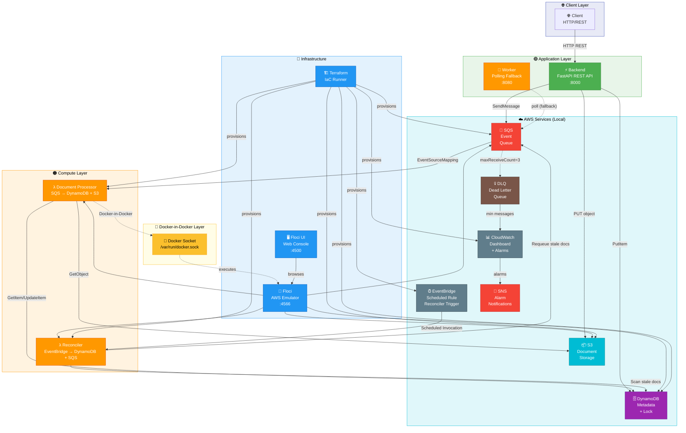
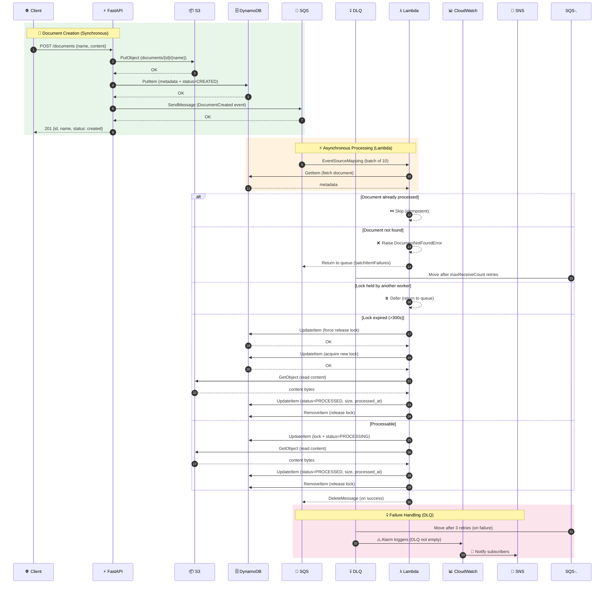
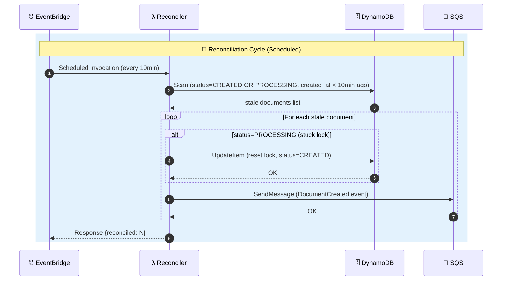
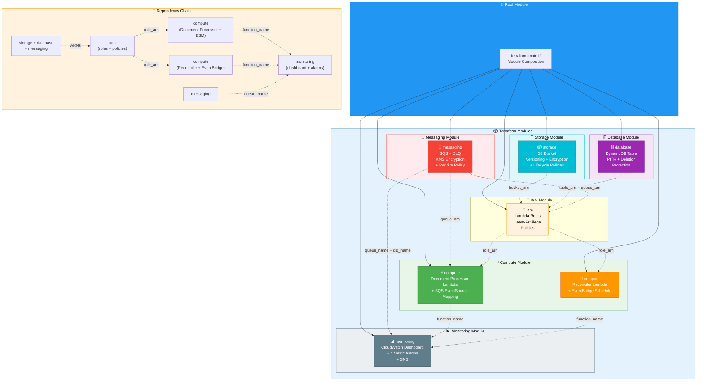
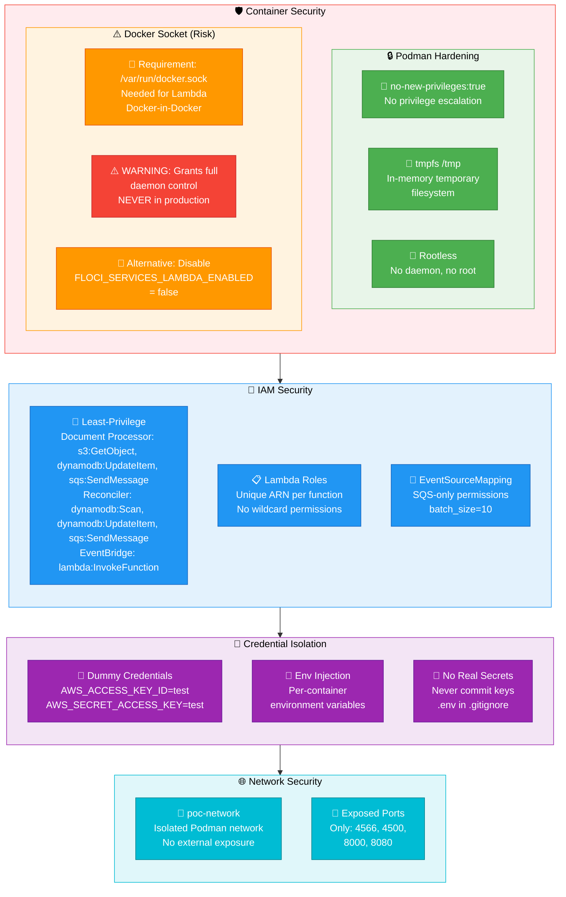
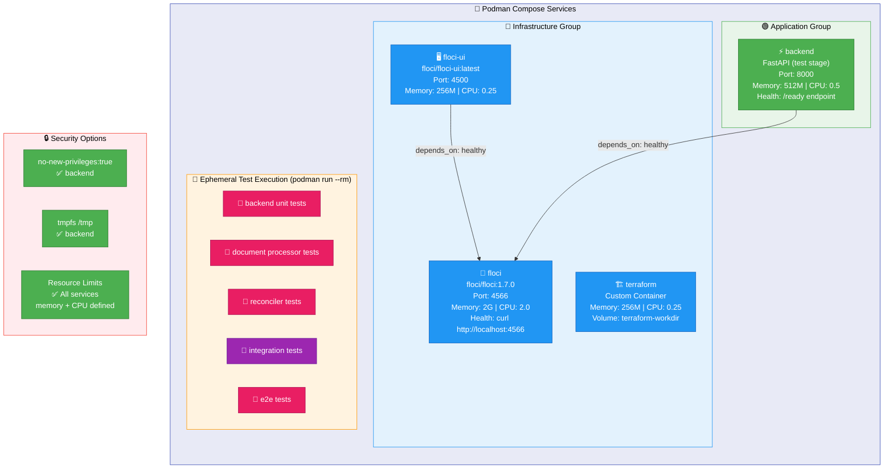
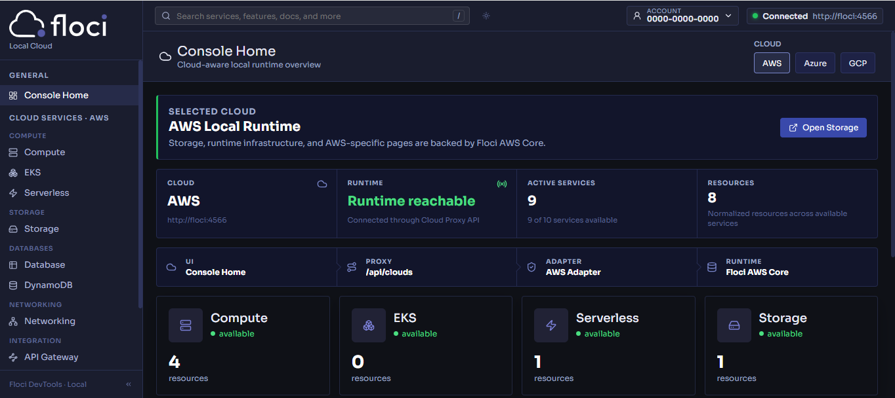
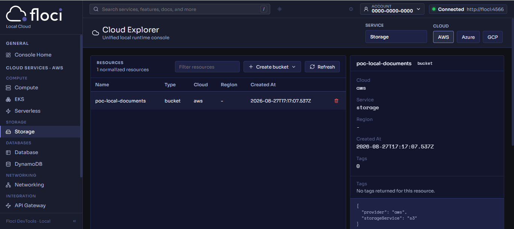
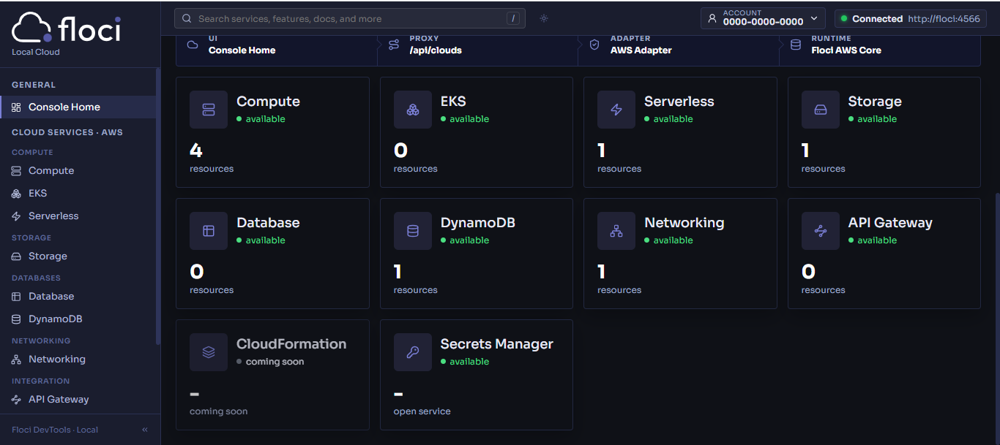
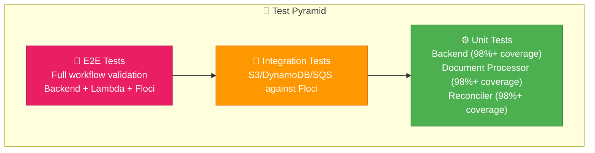

# 🏗️ AWS Cloud Architecture POC — Serverless Document Processing Pipeline

[](https://www.python.org/)
[](https://fastapi.tiangolo.com/)
[](https://www.terraform.io/)
[](https://podman.io/)
[](LICENSE)

A **production-grade AWS architecture POC** that validates Infrastructure as Code, event-driven processing, and distributed state management — from Terraform provisioning through Lambda-triggered asynchronous pipelines.

Built with Python, FastAPI, Terraform, and Podman, this project demonstrates that production-grade AWS patterns — **modular IaC**, **event-driven architecture**, **distributed locking**, **idempotent processing**, and **observability** — can be developed and tested against an AWS-compatible local runtime powered by Floci, producing identical boto3 code ready for real AWS.

### What This POC Demonstrates

| Pattern | Implementation |
|---------|---------------|
| **Infrastructure as Code** | 6 modular Terraform modules with explicit dependency chains and idempotent provisioning |
| **Event-Driven Architecture** | SQS + Lambda (Document Processor) with DLQ, resilient retries, and `ReportBatchItemFailures` for partial batch failure handling |
| **Scheduled Reconciliation** | EventBridge-scheduled Lambda (Reconciler) recovers orphan documents stuck in CREATED/PROCESSING state, ensuring eventual consistency |
| **Distributed Locking** | DynamoDB conditional writes with owner-based release and expired lock detection |
| **Idempotent Processing** | Worker verifies document status before processing, preventing double execution |
| **Observability** | CloudWatch dashboard with 4 metric alarms and SNS notifications |
| **Container Security** | Rootless Podman, no-new-privileges, tmpfs, resource limits per service |

[🏛️ Architecture](#%EF%B8%8F-architecture) · [🧭 Design Decisions](#-design-decisions) · [🚀 Why This Stack?](#-why-this-stack) · [💪 Strengths & Weaknesses](#-strengths--weaknesses) · [✨ Features](#-features) · [⚙️ Configuration](#-configuration) · [🧪 Testing](#-testing) · [🎬 Quick Start](#-quick-start) · [📁 Project Structure](#-project-structure) · [🔧 Rake Commands](#-rake-commands)

## 🏛️ Architecture Overview

This POC is designed to demonstrate and validate cloud-grade architecture patterns using an AWS-compatible local runtime. Each component was deliberately chosen to replicate real production decisions, showcasing transferable AWS skills.

- 🏗️ **Infrastructure as Code (Modular Terraform)** — Declarative and idempotent provisioning of the entire infrastructure through 6 independent modules (storage, database, messaging, compute, iam, monitoring) with clean interfaces and explicit dependency chains.

- ⚡ **Event-Driven Architecture (SQS + Lambda)** — Decoupled asynchronous communication between the REST API and the distributed processor, utilizing Dead Letter Queue (DLQ) for poison pill isolation and resilient retries.

- 🔄 **Scheduled Reconciliation (EventBridge + Lambda)** — A secondary Lambda (`reconciler`) runs on a CloudWatch EventBridge schedule, scanning for documents stuck in `CREATED` or `PROCESSING` state for over 10 minutes. It resets processing locks and requeues stale documents, ensuring eventual consistency without manual intervention.

- 🔒 **Distributed Locking (DynamoDB Conditional Writes)** — Atomic distributed locking via `ConditionExpression` in DynamoDB, preventing race conditions between workers with expired lock detection and owner-based release.

- 📨 **Idempotent Processing** — The worker verifies document status before processing, skipping already-processed documents (status=PROCESSED) and using atomic locks to prevent double concurrent processing.

- 🧪 **AWS-Compatible Local Runtime** — The entire stack (API, Lambda, SQS, DynamoDB, S3, CloudWatch) runs against Floci, an AWS emulator providing API parity with real services, enabling fast iteration cycles with identical boto3 code.

- 🐳 **Containerized Workflows (Podman)** — Complete orchestration via Podman Compose with 4 core runtime services (`floci`, `floci-ui`, `terraform`, `backend`), ephemeral test execution, and security hardening (rootless, no-new-privileges).

- 📊 **Observability (CloudWatch Dashboards + Alarms)** — Centralized dashboard with SQS depth, Lambda errors/throttles, and DLQ depth metrics, backed by 4 configured alarms and SNS notifications for proactive alerting.

## 🚀 Why This Stack?

### 🐍 Python + FastAPI

Python was chosen for its ubiquity in cloud-native development and its mature ecosystem for AWS services (boto3). FastAPI complements this choice with an async-first architecture that handles I/O operations — such as calls to S3, DynamoDB, and SQS — without blocking the event loop. Native Pydantic validation on request/response schemas eliminates entire classes of bugs at compile time, and automatic OpenAPI generation enables interactive API exploration without additional documentation.

FastAPI's dependency injection system is the cornerstone of the backend's layered architecture. The `DocumentStore` Protocol (Python's structural subtyping) defines the contract, `AwsDocumentStore` implements it for production, and `InMemoryDocumentStore` enables complete testing without any AWS connectivity. This follows the **Dependency Inversion Principle** — high-level modules don't depend on low-level modules; both depend on abstractions. The factory `create_app()` in `main.py:9` allows injecting any protocol implementation, making the service layer completely testable in isolation.

The result is a clean separation: **Routes** (HTTP layer) → **Services** (business logic) → **Stores** (infrastructure adapters). Each layer has a single responsibility and can be mocked or replaced independently.

### 🏗️ Terraform (Infrastructure as Code)

Terraform was chosen for its declarative and idempotent approach: you describe the desired state of the infrastructure and Terraform calculates the execution plan needed to reach it. This guarantees that running `terraform apply` multiple times produces the same result, eliminating the "configuration drift" that plagues manual environments. State managed centrally in a Podman volume (`terraform-workdir`) allows destroying and rebuilding the entire infrastructure in seconds.

The modular architecture with 6 independent modules (`storage`, `database`, `messaging`, `compute`, `iam`, `monitoring`) allows each concern to be testable and reusable independently. Each module exposes clean outputs (ARNs, names, URLs) that other modules consume, creating explicit dependency chains: `storage + database + messaging → iam → compute`. This modularization is exactly the pattern used in production — the POC demonstrates that the same structure works locally with Floci.

The declarative approach also facilitates clean destruction: `terraform destroy` removes all resources in the correct dependency order. For an educational POC, this is critical — it enables complete `provision → test → destroy → rebuild` cycles without residue or manual configuration.

### 🐳 Podman (Rootless Containers)

Podman was deliberately chosen over Docker for security and architectural reasons. It runs containers **without a daemon** and **without root privileges** by default — each container is a direct child process of the user, eliminating the attack surface represented by Docker's root daemon. This is especially relevant for a POC that mounts the Docker socket (`/var/run/docker.sock`) for Floci's Lambda simulation: running this in a rootless context significantly reduces risk.

CLI compatibility with Docker (`podman-compose` as a drop-in replacement) means the `compose.yaml` works with both tools without modifications. Containers run with `no-new-privileges:true` and `tmpfs /tmp`, applying security hardening that reflects production best practices. Each service has configured memory and CPU limits, and logs rotate automatically with `max-size` and `max-file`.

The result is a development experience identical to Docker but with a fundamentally superior security model: no central daemon, no root, and each container isolated as an independent user process.

### ⚡ Floci (Local AWS Emulator)

Floci emulates the complete API of core AWS services (S3, DynamoDB, SQS, Lambda) on a single port (4566), providing API parity with real services. This allows the same boto3 code — the same `PutObject`, `PutItem`, `SendMessage` calls — to work both locally against Floci and in production against real AWS. No conditional imports, no special configuration, no mocks: the code is identical.

CI/CD parity is the real benefit. Integration and E2E tests run against the same emulated API that the backend uses in development, ensuring that if tests pass locally, they will pass against real AWS (assuming configuration parity). The `hybrid` storage mode preserves state across container restarts, enabling iteration without reprovisioning the complete infrastructure each cycle.

Iteration speed is the other key benefit: no network latency, no cold starts, no service limits. A complete `terraform apply → backend start → test → destroy` cycle takes seconds, not minutes — invaluable for rapid prototyping and architectural exploration.

### 📨 SQS + DLQ (Event-Driven Decoupling)

SQS acts as the communication backbone between the REST API and the asynchronous processor, implementing the **event-driven architecture** pattern fundamental to distributed systems. The API publishes `DocumentCreated` events and forgets — it doesn't wait for processing confirmation, doesn't know the consumer, doesn't couple to its logic. This allows independent scaling of producers and consumers, and adding new consumers without modifying the API.

The Dead Letter Queue (DLQ) with `maxReceiveCount=3` implements the **poison pill isolation** pattern: malformed messages or those causing repeated errors are automatically moved to the dead letter queue after 3 attempts, preventing them from blocking the main queue. CloudWatch alarms on DLQ depth provide early observability — an operator knows immediately when something fails without manually reviewing logs.

Error handling in `lambda_handler` with `ReportBatchItemFailures` demonstrates the **retry resilience** pattern: each message is processed independently, failures don't affect successful messages, and messages blocked by distributed locks or referencing non-existent documents (`DocumentNotFoundError`) are returned to the queue for later retry. After `maxReceiveCount=3` failures, SQS automatically moves the message to the DLQ for poison pill isolation. This is exactly how a real Lambda would work in production.

### 🔒 Distributed Locking (DynamoDB Conditional Writes)

The distributed lock implemented via DynamoDB conditional writes is the POC's most sophisticated pattern, demonstrating how to coordinate concurrent work without a centralized coordinator. The `_acquire_processing_lock` operation in `handler.py:156` uses `ConditionExpression="attribute_not_exists(processing_owner) AND #status <> :processed"` to guarantee that only one worker can acquire the lock per document — the operation is atomic at the DynamoDB level.

Owner-based release (`ConditionExpression="processing_owner = :owner"`) prevents a worker from accidentally releasing another worker's lock. Expired lock detection (>300 seconds) enables automatic recovery when a worker dies without releasing its lock. Idempotent processing — documents with `status=PROCESSED` are skipped — guarantees that retries don't cause duplicate processing.

This pattern is exactly what would be used in production with real DynamoDB. The only difference is the endpoint: `localhost:4566` vs `dynamodb.eu-west-1.amazonaws.com`. The POC demonstrates that the concurrency logic, error handling, and failure recovery work correctly against an AWS-compatible API.

### 🔑 ULID vs UUID

ULIDs (Universally Unique Lexicographically Sortable Identifiers) were chosen over conventional UUIDs for two concrete advantages. First, ULIDs are **lexicographically orderable** — a ULID generated later has a string greater than one generated before. This is fundamental for DynamoDB, where ID order determines result order in queries without GSIs, and for S3, where ordered object keys facilitate listing and debugging.

Second, ULIDs are **collision-free** and **time-ordered**: each ID incorporates a 48-bit timestamp (milliseconds) + 80 bits of randomness, guaranteeing uniqueness without coordination. Unlike UUIDv4 which is completely random, the temporal component of ULID allows reconstructing the document creation timeline — an invaluable property for debugging and auditing in distributed systems.

The implementation in `documents.py:88` is trivial: `document_id = str(ULID())`. No namespace configuration, no synchronized clock dependencies, no practical collision risk. It's the correct choice for entity identifiers in a system combining DynamoDB (order matters) and S3 (paths matter).

## 💪 Strengths & Weaknesses

### ✅ Strengths

| Aspect | Detail |
|--------|--------|
| **Production-grade patterns** | IaC with Terraform, event-driven architecture, DLQ with `maxReceiveCount` and `ReportBatchItemFailures`, distributed locking, and idempotent processing — all patterns used in real production systems. |
| **Modular Terraform** | 6 independent modules (`storage`, `database`, `messaging`, `compute`, `iam`, `monitoring`) with clean interfaces. Each module is reusable across projects. |
| **Layered architecture** | Clean separation: Routes (HTTP) → DocumentService (logic) → DocumentStore (Protocol). Protocol-based dependency injection enables complete testing without AWS. |
| **Dual Lambda architecture** | Document Processor (SQS-triggered) + Reconciler (EventBridge-scheduled) — demonstrating event-driven processing with automatic orphan recovery. |
| **Reconciliation pattern** | Scheduled Lambda recovers orphan documents stuck in CREATED/PROCESSING state, ensuring eventual consistency without manual intervention. |
| **Distributed locking** | DynamoDB conditional writes with `ConditionExpression` prevent worker races. Locks expire at 300s and release is owner-verified. |
| **Idempotent processing** | Already-processed documents are gracefully skipped. DynamoDB conditional writes prevent double processing. |
| **Observability** | CloudWatch dashboard with 4 alarms (DLQ, Lambda errors, throttles, SQS depth), SNS notifications, and structured JSON logging across all services. |
| **Security hardening** | Rootless Podman, `no-new-privileges:true`, `tmpfs /tmp`, credential isolation, and KMS encryption on SQS. |
| **Comprehensive testing** | Unit tests with 98%+ coverage on backend, document processor, and reconciler. Integration tests against Floci, and E2E validating the complete `CREATED → PROCESSING → PROCESSED` flow. |
| **Reproducible automation** | Rake as the single entry point for development, testing, and deployment. `rake up` brings up the entire stack with one command. |

### ⚠️ Weaknesses / Tradeoffs

| Aspect | Detail |
|--------|--------|
| **Local emulator fidelity** | Floci doesn't replicate AWS service limits, IAM policies, VPC networking, or eventual consistency behaviors. DLQ redrive timing depends on `visibility_timeout_seconds` (330s), which may differ from real AWS enforcement. Tests may pass locally but fail on real AWS. |
| **No real Lambda cold starts** | Lambda execution in Floci uses Docker-in-Docker, which doesn't simulate real cold start latency or Lambda service concurrency limits. |
| **No EventBridge emulator** | Reconciler schedule works on real AWS but Floci may not emulate EventBridge rules. Manual testing via `--once` flag required locally. |
| **Single-region only** | The architecture assumes a single AWS region. Cross-region replication and multi-region failover are not addressed. |
| **No TLS termination** | The backend serves plain HTTP. A production deployment would require a reverse proxy (nginx) or ALB for TLS. |
| **Stateful Terraform** | State is stored in a Podman volume (`terraform-workdir`). Production should use S3 + DynamoDB for remote state with locking. |
| **Docker socket exposure** | The `/var/run/docker.sock` mount grants full Docker daemon control to the Floci container. Required for Lambda simulation but insecure for production. |
| **No CI/CD pipeline** | While Rake replicates CI validations locally, no GitHub Actions or external pipeline is configured. Validation depends on running `rake test` manually. |


## 🧭 Design Decisions

### 🧱 Layered Architecture with Protocol-Based DI

The backend follows a strict three-layer architecture:

```text
Routes (HTTP) → DocumentService (business) → DocumentStore (protocol) → AwsDocumentStore (AWS)
```

The `DocumentStore` Protocol (`backend/app/services/documents.py:18-43`) defines the contract via Python's *structural subtyping*. Each method is explicitly declared with `# pragma: no cover` to emphasize it's an interface, not a concrete implementation. `AwsDocumentStore` implements it for production using boto3, while `InMemoryDocumentStore` (`backend/app/services/documents.py:45-77`) stores data in Python dictionaries for tests without any AWS connectivity.

Dependency injection occurs in `create_app()` (`backend/app/main.py:9-18`): the `document_service` is injected as an optional parameter, and if not provided, it's built with `AwsDocumentStore`. This allows overriding the complete store in tests:

```python
class DocumentStore(Protocol):
    def save(self, document: Document, content: str) -> None: ...
    def get(self, document_id: str) -> Document | None: ...
```

This separation follows the **Dependency Inversion Principle** — high-level modules don't depend on low-level modules; both depend on abstractions. The result is a service layer testable at 98%+ without AWS mocks.


### ⚡ Dual Lambda Architecture

The `lambda/` directory contains two distinct Lambda functions serving complementary roles:

1. **Document Processor** (`handler.py`) — Processes SQS `DocumentCreated` events with `ReportBatchItemFailures` support. Implements distributed locking via DynamoDB conditional writes, idempotent processing (skips already-processed documents), and status transitions (CREATED → PROCESSING → PROCESSED). Can also run as a polling worker via `SqsWorker` class with `--poll` or `--once` flags. The processor is initialized once at module level (`_lambda_processor`) to reuse connections on *warm starts*.

2. **Reconciler** (`reconciler.py`) — Scheduled Lambda triggered by CloudWatch EventBridge (every 10 minutes). Scans DynamoDB for documents stuck in `CREATED` or `PROCESSING` state for over 10 minutes, resets stale processing locks, and requeues documents for reprocessing via SQS. Ensures eventual consistency without manual intervention. Can also run as a standalone worker via `--poll` or `--once` flags.

Both functions share the same container image and DynamoDB table, but serve different purposes: the Document Processor handles the happy path (event-driven), while the Reconciler handles failure recovery (scheduled reconciliation).


### 🔒 Distributed Lock via DynamoDB

The worker uses DynamoDB *conditional writes* as a distributed locking mechanism. The key expression is:

```python
ConditionExpression="attribute_not_exists(processing_owner) AND #status <> :processed"
```

This guarantees atomicity: only one worker can acquire the lock for a document at a time. The condition verifies two things simultaneously — that no current owner exists (`attribute_not_exists`) and that the document isn't already processed (`#status <> :processed`). If another worker already acquired the lock, DynamoDB throws `ConditionalCheckFailedException` and the worker returns the message to the queue.

Lock release is owner-gated: only the worker that acquired it can release it:

```python
ConditionExpression="processing_owner = :owner"
```

Additionally, expired lock detection (`MAX_LOCK_AGE_SECONDS = 300`) is implemented: if a lock is older than 5 minutes, any worker can force its release using `_force_release_expired_lock`, preventing documents from being permanently blocked by dead workers.


### 📦 Container Topology and Ephemeral Test Execution

The `compose.yaml` is streamlined to contain only the **4 core runtime services**:

- **Core Runtime Services**: `floci`, `floci-ui`, `terraform`, and `backend`.
- **Ephemeral Test Execution**: All unit, integration, and E2E tests run on demand in isolated, disposable containers (`podman run --rm`) managed via `Rakefile`.

This decoupled design avoids container name collisions, keeps `compose.yaml` maintainable (~150 lines), and ensures tests run in clean, anonymous environments.


### 📊 Terraform Module Composition

The `terraform/main.tf` composes 6 modules with explicit dependency chains:

```text
storage + database + messaging → iam → compute (Document Processor + Reconciler)
messaging + compute → monitoring
```

The three base modules (`storage`, `database`, `messaging`) are instantiated first without dependencies between them. The `iam` module receives the resulting ARNs (`bucket_arn`, `table_arn`, `queue_arn`) to create least-privilege policies for both Lambda functions. The `compute` module provisions two Lambda functions: the Document Processor (SQS-triggered via EventSourceMapping) and the Reconciler (EventBridge-scheduled). `monitoring` depends on `messaging` (queue names) and `compute` (both Lambda function names) to configure alarms and dashboard.

Each module exposes clean outputs (ARNs, names, URLs) that other modules consume. This modular composition means each concern is independently testable and reusable — the `storage` module for example, could be reused in any project needing an S3 bucket with versioning and lifecycle policies.


### 🔄 Idempotent Document Processing

The document lifecycle implements an explicit state machine:

```text
CREATED → PROCESSING → PROCESSED
    └→ FAILED (on error)
    └→ DLQ (after maxReceiveCount retries)
```

Idempotency is achieved at multiple levels. In `DocumentProcessor.process()` (`lambda/handler.py:118-162`), the first step is to verify the document exists in DynamoDB: if not, `DocumentNotFoundError` is raised, causing the message to be retried and eventually moved to the DLQ after `maxReceiveCount` failures. If the document exists and is already `PROCESSED`, `"skipped"` is returned immediately. This prevents reprocessing even if the SQS message arrives multiple times.

The `CREATED → PROCESSING` transition occurs under the distributed lock, guaranteeing that only one worker performs the transition. If processing fails, `FAILED` is set and the lock is released. Cleanup in `DocumentService.create_document()` (`backend/app/services/documents.py:87-122`) is also idempotent: if SQS fails after saving to S3/DynamoDB, both stores are cleaned up before propagating the error.

Tests explicitly verify these scenarios: already-processed documents are skipped, conflicting locks are returned to the queue, and infrastructure errors trigger correct rollback.


## 🏛️ Architecture

### 📊 Component Diagram



### 🔄 Document Flow (Sequence Diagram)



### 🔄 Reconciliation Flow (Sequence Diagram)



### 🏗️ Terraform Module Composition



---

### 🔒 Security Flow



### 🐳 Container Topology



## ✨ Features

### 🔌 API Endpoints

| Method | Path | Status | Description |
|--------|------|--------|-------------|
| `GET` | `/health` | 200 | Simple liveness check |
| `GET` | `/ready` | 200 | Dependency health check (S3, DynamoDB, SQS) |
| `POST` | `/documents` | 201 | Create document (name + content) |
| `GET` | `/documents/{id}` | 200 | Get document metadata |
| `GET` | `/documents/{id}/content` | 200 | Get document content (binary) |
| `DELETE` | `/documents/{id}` | 204 | Delete document (S3 + DynamoDB) |

### ☁️ AWS Resources (Local)

| Resource | Name | Purpose |
|----------|------|---------|
| S3 Bucket | `poc-local-documents` | Document binary storage with versioning |
| DynamoDB Table | `poc-local-documents-metadata` | Document metadata + status tracking |
| SQS Queue | `poc-local-document-events` | Async event publication |
| SQS DLQ | `poc-local-document-events-dlq` | Dead letter queue (maxReceiveCount=3) |
| Lambda | `poc-local-document-processor` | SQS-triggered async processor |
| Lambda | `poc-local-document-reconciler` | Scheduled orphan document recovery (EventBridge trigger) |
| EventBridge Rule | `poc-local-document-reconciler-rule` | Triggers reconciler Lambda on schedule |
| CloudWatch Dashboard | `*-dashboard` | SQS depth, Lambda metrics, DLQ depth |
| CloudWatch Alarms | 4 alarms | DLQ not empty, Lambda errors, throttles, SQS depth |

### 📄 Document Workflow

```text
POST /documents {name, content}
  ├── 1. Generate ULID (lexicographically sortable, collision-free)
  ├── 2. S3 PutObject (documents/{id}/{name})
  ├── 3. DynamoDB PutItem (metadata + status=CREATED)
  ├── 4. SQS SendMessage (DocumentCreated event)
  └── 5. Return 201 {id, name, status}

SQS → Lambda (async)
  ├── 1. GetItem from DynamoDB
  ├── 2. Check document exists (raise DocumentNotFoundError if missing)
  ├── 3. Check idempotency (skip if PROCESSED)
  ├── 4. Acquire distributed lock (conditional write)
  ├── 5. Update status → PROCESSING
  ├── 6. GetObject from S3
  ├── 7. Update status → PROCESSED + size + processed_at
  └── 8. Release lock

On failure (missing doc, S3 error, lock contention):
  → Return batchItemFailures → SQS retries → DLQ after maxReceiveCount=3
```

### 🔄 Reconciliation Workflow

```text
EventBridge → Reconciler Lambda (every 10 minutes)
  ├── 1. Scan DynamoDB (status=CREATED OR PROCESSING, created_at < 10min ago)
  ├── 2. For each stale document:
  │   ├── If status=PROCESSING → Reset lock + status=CREATED
  │   └── SendMessage (DocumentCreated event) to SQS
  └── 3. Return {reconciled: N}

Purpose: Recover orphan documents stuck due to:
  - Worker crash without lock release
  - Lambda timeout during processing
  - Network partition during DynamoDB update
```

### 🖥️ Local Console (Floci UI)

A visual web console for browsing and managing AWS resources:

| Component | URL | Description |
|-----------|-----|-------------|
| Floci UI | http://localhost:4500 | Console Home, Cloud Explorer |

Features:
- S3 bucket browser (upload/download/delete objects)
- DynamoDB table viewer (create/scan/delete items)
- SQS queue manager (send/receive/delete messages)
- Lambda function inspector
- CloudWatch log viewer

#### Console Home — AWS Local Runtime Overview



#### Cloud Explorer — S3 Bucket with Metadata



#### Full Dashboard — All AWS Services



---

## ⚙️ Configuration

### 🔐 Local AWS Credentials

Use dummy credentials only — never real AWS keys:

```powershell
$env:AWS_ENDPOINT_URL = "http://localhost:4566"
$env:AWS_DEFAULT_REGION = "eu-west-1"
$env:AWS_ACCESS_KEY_ID = "test"
$env:AWS_SECRET_ACCESS_KEY = "test"
```

When services run inside Compose, application containers use:

```text
AWS_ENDPOINT_URL=http://floci:4566
```

### 📄 Backend Environment Variables

| Variable | Default | Description |
|----------|---------|-------------|
| `AWS_ENDPOINT_URL` | `http://localhost:4566` | Floci endpoint |
| `AWS_DEFAULT_REGION` | `eu-west-1` | AWS region |
| `AWS_ACCESS_KEY_ID` | `test` | Dummy access key |
| `AWS_SECRET_ACCESS_KEY` | `test` | Dummy secret key |
| `S3_BUCKET` | `poc-local-documents` | S3 bucket name |
| `DYNAMODB_TABLE` | `poc-local-documents-metadata` | DynamoDB table name |
| `SQS_QUEUE_NAME` | `poc-local-document-events` | SQS queue name |

### 🏗️ Terraform Variables

| Variable | Default | Description |
|----------|---------|-------------|
| `project_name` | `poc-local` | Project name prefix for all resources |
| `environment` | `local` | Environment name (local, staging, prod) |
| `aws_region` | `eu-west-1` | AWS region |
| `alarm_email` | `""` | Optional email for CloudWatch alarm notifications |
| `lambda_aws_endpoint_url` | `http://localhost:4566` | Lambda function's AWS endpoint |

### 🔧 Terraform State

The Terraform state is managed via a named Podman volume (`terraform-workdir`), persisted across container restarts. The Rakefile automates:

1. Syncing local `terraform/` files into the volume
2. Running `terraform init/apply/destroy` inside the container
3. Syncing state back to the host

---

## 🧪 Testing

### 📊 Test Pyramid



### ⚙️ Unit Tests

Backend, document processor, and reconciler tests with **98%+ coverage threshold**:

```powershell
# Backend unit tests
rake backend:test

# Document processor unit tests
rake worker:test

# Reconciler unit tests
rake reconciler:test

# All unit tests together
rake test:unit
```

Tests verify:
- Document CRUD operations
- AWS store adapter (S3, DynamoDB, SQS)
- Document Processor: Lambda handler batch processing
- Document Processor: Distributed lock acquisition/release
- Document Processor: Idempotent processing
- Document Processor: Error handling and rollback
- Reconciler: Stale document detection
- Reconciler: Lock reset and requeue logic
- DocumentStatus enum synchronization between backend and Lambda

### 🔗 Integration Tests

Tests against real Floci (S3, DynamoDB, SQS):

```powershell
rake integration:test
```

### 🎯 End-to-End Tests

Full workflow validation (Floci + Backend + Lambda):

```powershell
rake e2e:test
```

The E2E suite starts the full stack and verifies that a document progresses through all states: `CREATED → PROCESSING → PROCESSED`.

### 🚀 Run All Tests

```powershell
rake test
```

---

## 🎬 Quick Start

### 📋 Prerequisites

| Tool | Version | Check |
|------|---------|-------|
| Podman | 5.x+ | `podman --version` |
| Podman Compose | - | `podman-compose --version` |
| Terraform | >= 1.8.0 | `terraform --version` |
| Python | >= 3.12 | `python --version` |
| Ruby | - | `ruby --version` |
| Rake | - | `rake --version` |
| AWS CLI | - | `aws --version` |
| curl | - | `curl --version` |

### 🚀 Start Everything

```powershell
rake up
```

This single command:
1. Starts Floci (local AWS emulator)
2. Runs `terraform init` + `terraform apply`
3. Packages and uploads the Lambda function to S3
4. Starts the FastAPI backend
5. Starts the Floci UI console

### 🛑 Stop and Tear Down

```powershell
rake down
```

### 🔧 Individual Commands

```powershell
# Start only Floci
rake floci:start

# Provision infrastructure only
rake infra:deploy

# Start only the backend
rake backend:start

# Start only the UI
rake ui:start

# Check tool availability
rake doctor
```

### 🧪 Verify Everything Works

```powershell
# Run all tests
rake test

# Check service status
rake status

# View logs
rake logs
```

---

## 📁 Project Structure

```text
.
├── backend/                          # FastAPI REST API
│   ├── Containerfile                 # Multi-stage container build
│   ├── pyproject.toml                # Python project config
│   ├── requirements.txt              # Dependencies
│   ├── app/
│   │   ├── main.py                   # App factory (create_app)
│   │   ├── settings.py               # Environment-based configuration
│   │   ├── schemas.py                # Pydantic request/response models
│   │   ├── domain.py                 # Document domain model (imports from shared)
│   │   ├── logging.py                # Structured JSON logging (imports from shared)
│   │   ├── api/
│   │   │   └── routes.py             # HTTP route handlers
│   │   └── services/
│   │       ├── aws.py                # AWS (boto3) document store adapter
│   │       └── documents.py          # Document service + Protocol
│   └── tests/                        # Unit tests (98%+ coverage)
│
├── shared/                           # Shared types and utilities
│   ├── __init__.py                   # Public API re-exports
│   ├── domain.py                     # DocumentStatus enum (single source of truth)
│   ├── logging.py                    # Structured JSON logging factory
│   ├── exceptions.py                 # DocumentNotFoundError
│   └── constants.py                  # Shared constants (event types, defaults)
│
├── lambda/                           # Lambda functions (dual architecture)
│   ├── Containerfile                 # Multi-stage container build
│   ├── handler.py                    # Document Processor: SQS → DynamoDB + S3
│   ├── reconciler.py                 # Reconciler: EventBridge → orphan recovery
│   └── tests/                        # Unit tests (98%+ coverage)
│       ├── test_handler.py           # Document Processor tests
│       └── test_reconciler.py        # Reconciler tests
│
├── terraform/                        # Infrastructure as Code
│   ├── main.tf                       # Root module composition
│   ├── versions.tf                   # Terraform + provider versions
│   ├── provider.tf                   # AWS provider (Floci endpoints)
│   ├── variables.tf                  # Root variables
│   ├── locals.tf                     # Naming conventions + common tags
│   ├── outputs.tf                    # Root outputs
│   ├── container/
│   │   └── Containerfile             # Terraform container image
│   ├── environments/
│   │   └── local/
│   │       └── terraform.tfvars      # Local environment variables
│   └── modules/
│       ├── storage/                  # S3 bucket module
│       ├── database/                 # DynamoDB table module
│       ├── messaging/                # SQS queue + DLQ module
│       ├── compute/                  # Document Processor + Reconciler Lambda
│       ├── iam/                      # IAM role + policies module
│       └── monitoring/               # CloudWatch dashboard + alarms module
│
├── tests/
│   ├── integration/                  # Integration test suite
│   │   └── tests/
│   │       └── test_floci_integration.py
│   └── e2e/                          # End-to-end test suite
│       └── tests/
│           └── test_document_workflow.py
│
├── compose.yaml                      # Podman Compose services (4 core runtime services)
├── Rakefile                          # Task automation (278 lines)
├── .env.example                      # Environment variable template
├── .gitignore                        # Git ignore rules
├── LICENSE                           # MIT License
└── README.md                         # This file
```

---

## 🔧 Rake Commands

### 🏗️ Infrastructure

| Command | Description |
|---------|-------------|
| `rake floci:start` | Start Floci AWS emulator |
| `rake floci:down` | Stop Floci and all services |
| `rake infra:deploy` | Full deploy: Floci → Terraform → Lambda upload → .env |
| `rake infra:destroy` | Destroy all Terraform-managed resources |

### 🚀 Application

| Command | Description |
|---------|-------------|
| `rake up` | Start everything (Floci + Infra + Backend + UI) |
| `rake down` | Stop and destroy all services |
| `rake backend:start` | Start the FastAPI backend |
| `rake worker:start` | Start the Lambda polling worker |
| `rake reconciler:start` | Start the document reconciler worker |
| `rake ui:start` | Start the Floci UI console |

### 🧪 Testing

| Command | Description |
|---------|-------------|
| `rake test` | Run all tests (unit + integration + e2e) |
| `rake test:unit` | Run backend + worker + reconciler unit tests |
| `rake test:integration` | Run integration tests against Floci |
| `rake test:e2e` | Run end-to-end workflow tests |
| `rake backend:test` | Run backend unit tests (98%+ coverage) |
| `rake worker:test` | Run worker unit tests (98%+ coverage) |
| `rake reconciler:test` | Run reconciler unit tests (98%+ coverage) |
| `rake integration:test` | Run integration tests |
| `rake e2e:test` | Run E2E tests |

### 🔍 Diagnostics

| Command | Description |
|---------|-------------|
| `rake doctor` | Check required local tools |
| `rake status` | Show status of all POC containers |
| `rake logs` | Show logs for all running services |

---

## 📄 License

This is a Proof of Concept. Not intended for production use.

This project is licensed under the MIT License, an open-source software license that allows developers to freely use, copy, modify, and distribute the software. This includes use in both personal and commercial projects, with the only requirement being that the original copyright notice is retained.

```
MIT License

Copyright (c) 2026 Sergio Sanchez

Permission is hereby granted, free of charge, to any person obtaining a copy
of this software and associated documentation files (the "Software"), to deal
in the Software without restriction, including without limitation the rights
to use, copy, modify, merge, publish, distribute, sublicense, and/or sell
copies of the Software, and to permit persons to whom the Software is
furnished to do so, subject to the following conditions:

The above copyright notice and this permission notice shall be included in all
copies or substantial portions of the Software.

THE SOFTWARE IS PROVIDED "AS IS", WITHOUT WARRANTY OF ANY KIND, EXPRESS OR
IMPLIED, INCLUDING BUT NOT LIMITED TO THE WARRANTIES OF MERCHANTABILITY,
FITNESS FOR A PARTICULAR PURPOSE AND NONINFRINGEMENT. IN NO EVENT SHALL THE
AUTHORS OR COPYRIGHT HOLDERS BE LIABLE FOR ANY CLAIM, DAMAGES OR OTHER
LIABILITY, WHETHER IN AN ACTION OF CONTRACT, TORT OR OTHERWISE, ARISING FROM,
OUT OF OR IN CONNECTION WITH THE SOFTWARE OR THE USE OR OTHER DEALINGS IN THE
SOFTWARE.
```

---

> **Note:** This POC is developed for educational and research purposes. It demonstrates production-grade AWS architecture patterns using an AWS-compatible local runtime. It is not intended for production deployment. The local emulator provides API parity but does not replicate AWS service limits, networking, security boundaries, or global infrastructure.

**Built with ❤️ using Python, FastAPI, Terraform, Podman & AWS-compatible services**

[⬆️ Back to Top](#-aws-cloud-architecture-poc--serverless-document-processing-pipeline)
